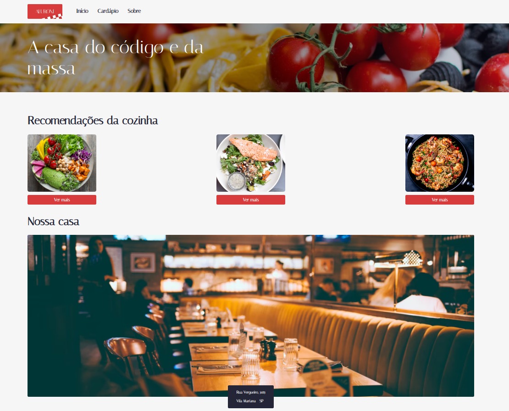
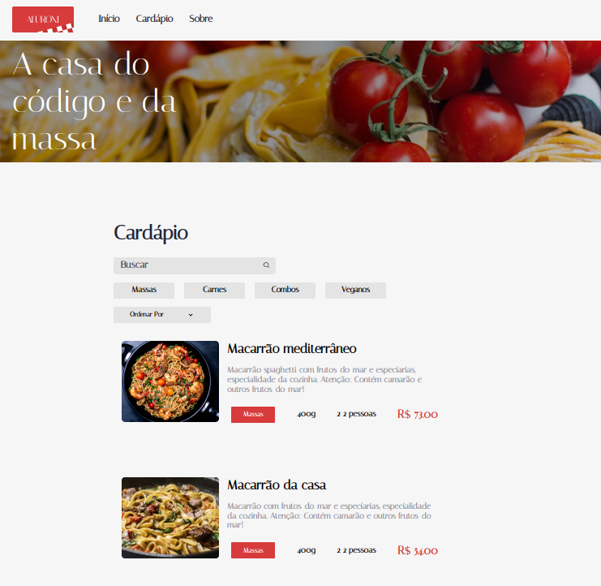
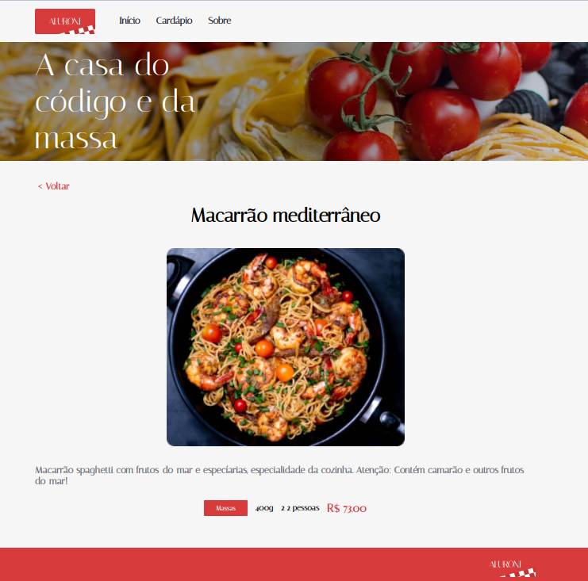
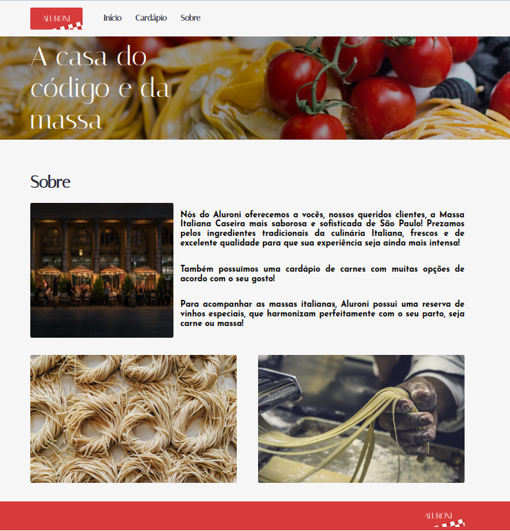

# Alura Curso React Rotas

Curso de react com typescript da plataforma Alura para estudo das rotas no react

## Iniciar

Para executar o projeto, execute o comando abaixo para instalar todas as dependências:

```
npm i
```

Feito isto, execute

```
npm start
```

para rodar o projeto no browser

## Preview do projeto



<hr>



<hr>



<hr>


